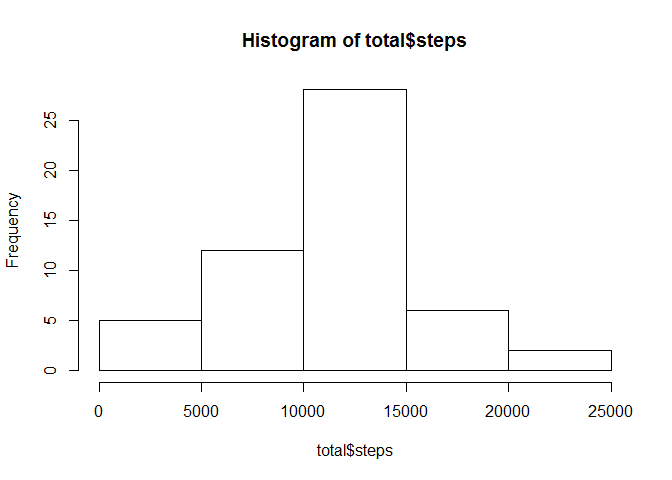
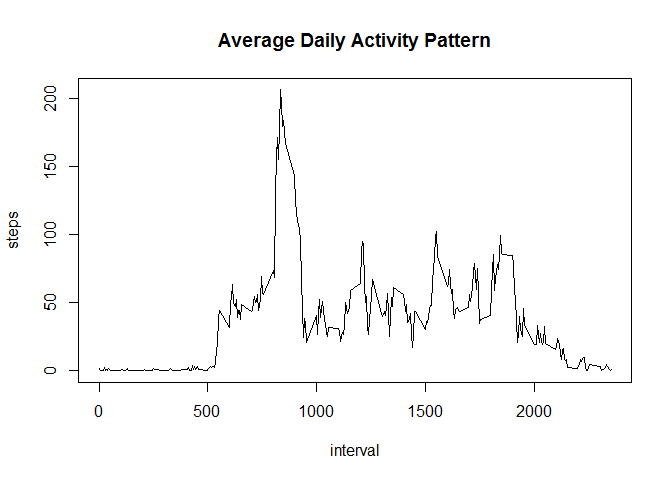
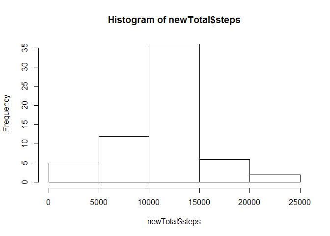
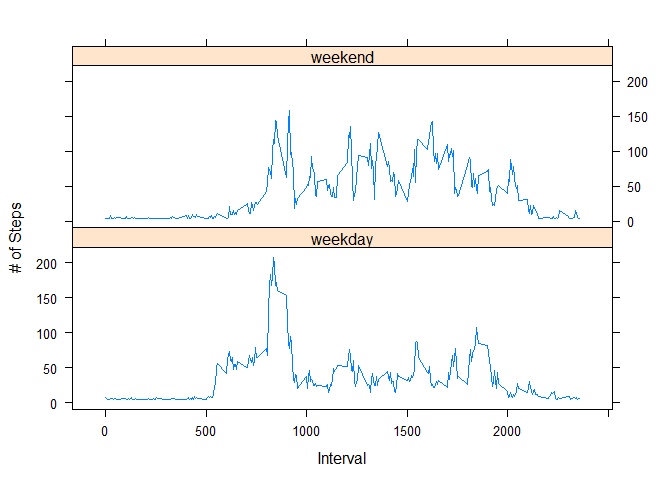

# Reproducible Research: Peer Assessment 1


## Loading and preprocessing the data

```r
df <- read.csv("activity.csv", colClasses=c("integer", "character", "integer"))
df$date <- as.Date(df$date, format="%Y-%m-%d")
```

## What is mean total number of steps taken per day?

```r
total <- with(df, aggregate(steps~date, FUN=sum, na.rm=TRUE))
hist(total$steps)
```



```r
meanSteps <- as.integer(mean(total$steps, na.rm=TRUE))
medianSteps <- median(total$steps, na.rm=TRUE)
```
The mean of steps taken per day is 10766 and the median of steps taken per day is 10765

## What is the average daily activity pattern?

```r
timeSeries <- with(df, aggregate(steps ~ interval, FUN=mean, na.rm=TRUE))
with(timeSeries, plot(interval, steps, type="l", main="Average Daily Activity Pattern"))
```



```r
stepsMax <- as.integer(max(timeSeries$steps))
intervalMax <- timeSeries[which.max(timeSeries$steps),1]
```
Averaged across all the days in the dataset, the maximum number of steps is 206 and is on interval 835.


## Imputing missing values

```r
totalNA <- sum(is.na(df$steps))
meanFiller <- as.integer(mean(df$steps, na.rm=TRUE))
newDF <- data.frame(df)
newDF[is.na(df$steps),1] <- meanFiller
sum(is.na(newDF))
```

```
## [1] 0
```

```r
newTotal <- with(newDF, aggregate(steps~date, FUN=sum, na.rm=TRUE))
hist(newTotal$steps)
```



```r
meanSteps <- mean(newTotal$steps, na.rm=TRUE)
medianSteps <- median(newTotal$steps, na.rm=TRUE)
```
Averaged across all the days in the dataset, the maximum number of steps is 206 and is on interval 835.

## Are there differences in activity patterns between weekdays and weekends?

```r
newDF$week <- weekdays(newDF$date)
newDF$week[!(newDF$week == 'Saturday'|newDF$week == 'Sunday')] <- 'weekday'
newDF$week[(newDF$week == 'Saturday'|newDF$week == 'Sunday')] <- 'weekend'
library(plyr)
library(lattice)
week <- ddply(newDF, c("interval", "week"), function(x) apply(x[1],2, mean))
head(week)
```

```
##   interval    week    steps
## 1        0 weekday 6.955556
## 2        0 weekend 4.625000
## 3        5 weekday 5.333333
## 4        5 weekend 4.625000
## 5       10 weekday 5.088889
## 6       10 weekend 4.625000
```

```r
xyplot(steps ~ interval | week, data = week, type="l", xlab="Interval", ylab="# of Steps", layout = c(1,2))
```




